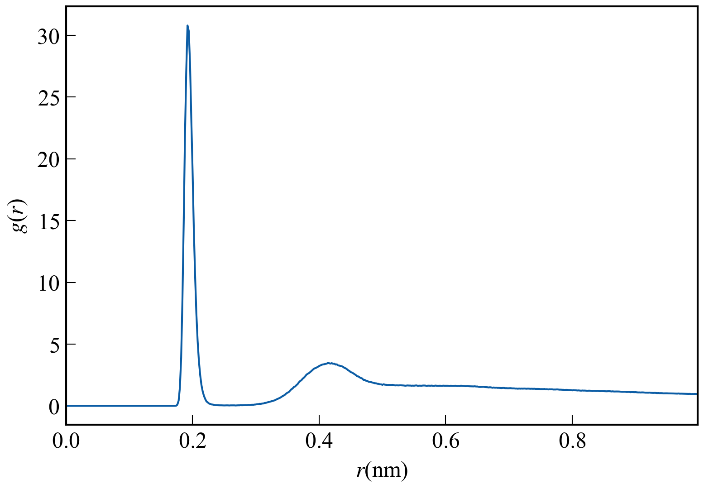
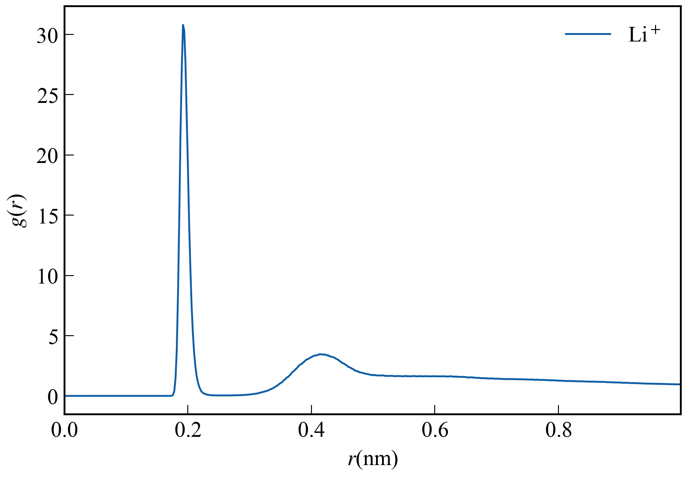
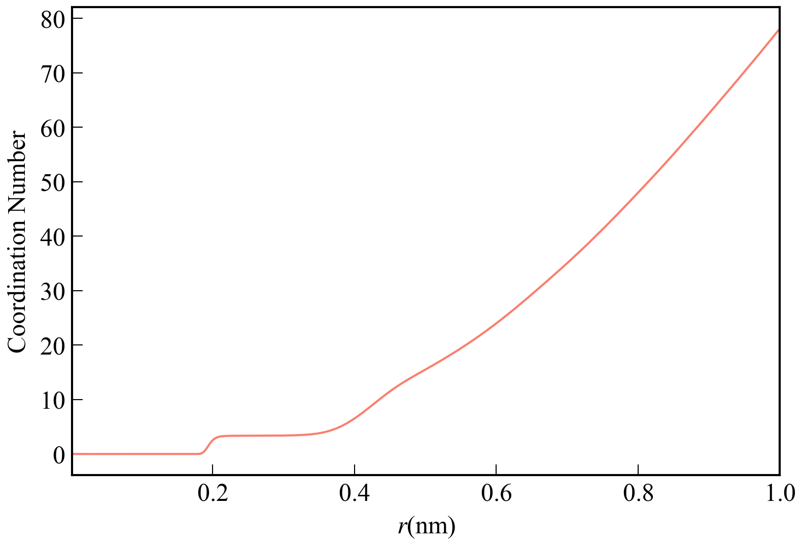
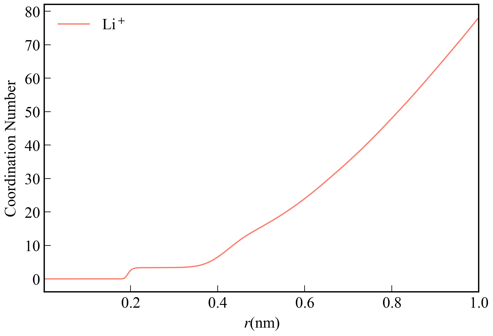
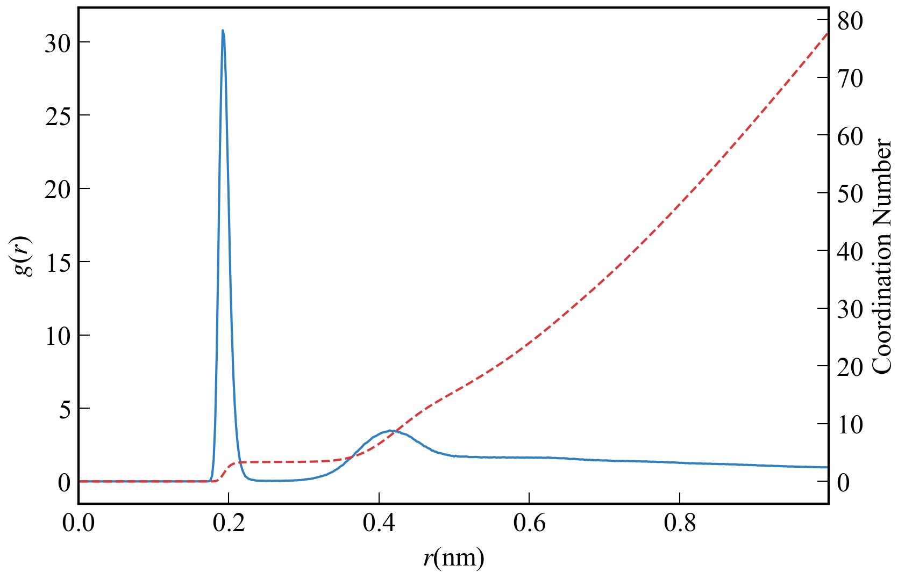
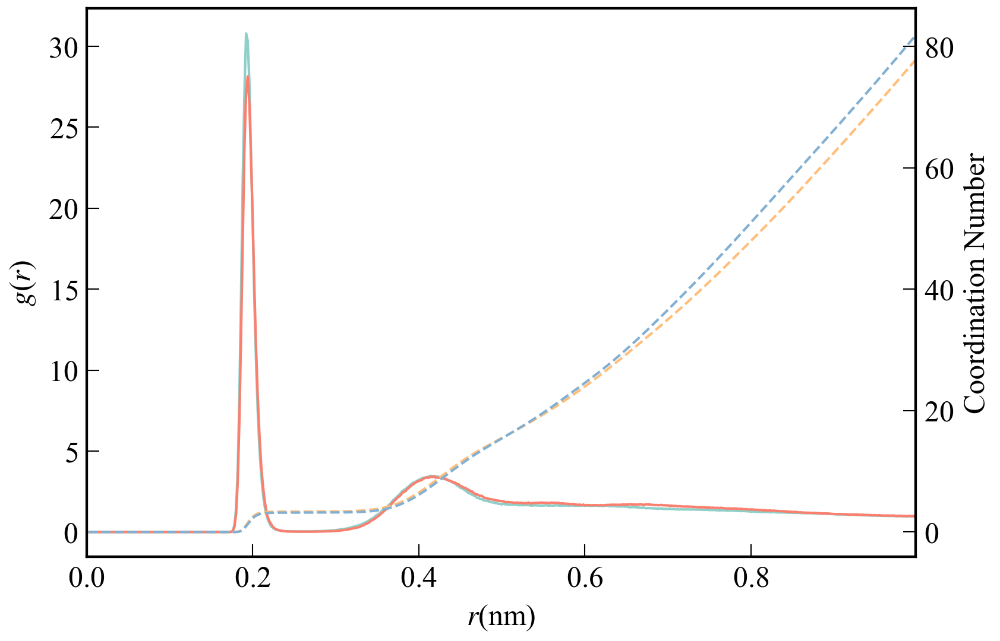
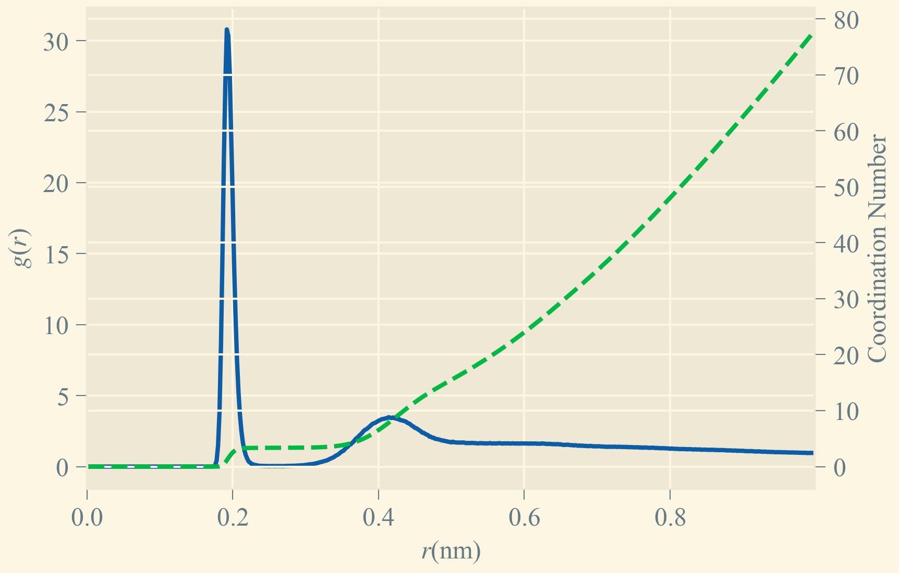
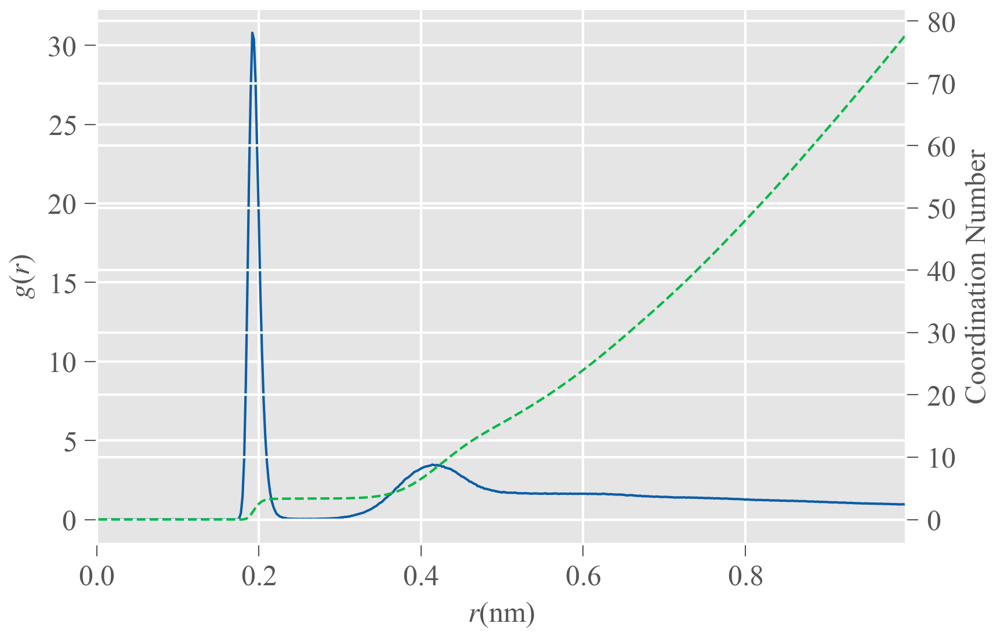

# drawRDF
`drawRDF`是一款开源的绘图软件，旨在从gromacs (https://www.gromacs.org/) 的`gmx rdf`命令获得的xvg文件直接绘制径向分布函数图像与配位数图像。目前`drawRDF`的最新版本为`drawRDF_1.1`

### 使用方法
目录下`drawRDF_1.1.py`为`drawRDF_1.1`软件的python源代码，`drawRDF_1.1.exe`为其的可执行文件。双击`drawRDF_1.1.exe`就可以运行该软件。运行该软件后，首先会看到以下的内容：
```
Draw radial distribution function or coordination number curve from xvg file produced by gromacs
Version 1.1, release date: 2024-Jul-29
Programmed by Jian Zhang (jian_zhang@cug.edu.cn)

Please input the path of xvg file and enter 'q' to perform the next step.
```
随后，逐个拉进需要绘图的xvg文件，按`q`回车即可结束文件载入，如下图所示。
```
Draw radial distribution function or coordination number curve from xvg file produced by gromacs
Version 1.1, release date: 2024-Jul-29
Programmed by Jian Zhang (jian_zhang@cug.edu.cn)

Please input the path of xvg file and enter 'q' to perform the next step.
C:\Users\89732\Desktop\office-automation\ts\rdf-CL-1.4.xvg
Please input the path of xvg file and enter 'q' to perform the next step.
C:\Users\89732\Desktop\office-automation\ts\rdf_cn.xvg
Please input the path of xvg file and enter 'q' to perform the next step.
C:\Users\89732\Desktop\office-automation\ts\rdf-CL-0.xvg
Please input the path of xvg file and enter 'q' to perform the next step.
q
```
随后，出现下面的菜单选项：
```
The number of Radial distribution curve: 2
The number of Cumulative Number RDF curve: 1
0  Whether to turn on the legend: False
1  The dpi of output picture: 300
2  The color of curve in output picture: #0C5DA5, #00B945, #FF9500
3  The path of style sheets: ./style/no-latex.mplstyle, ./style/my.mplstyle
4  The label of curves: CL \ CL \ name OW
5  The position of label: best
6  The range of x-axis: (0,1)
d  Start to draw picture
s  Save the picture
q  Exit program
```
最上面两行用于说明传入的`xvg`文件中数据为径向分布函数和配位数曲线文件的个数。
* 按`0`: 选择是否开启每一条曲线的图例，默认不开启
* 按`1`: 选择输出图片的分辨率，默认300
* 按`2`: 设置每一条曲线颜色的十六进制码，默认的颜色有`#0C5DA5`，`#00B945`，`#FF9500`，`#FF2C00`，`#845B97`，`#474747`和`#9e9e9e`
* 按`3`: 设置作图格式文件路径，默认为`./style/no-latex.mplstyle`和`./style/my.mplstyle`
* 按`4`: 设置每一条曲线的图例，只有当`0`选项为`True`时，该设置才起作用，默认值直接从`xvg`文件中相关字段提取
* 按`5`: 设置图例的位置，可选的位置有`best`，`upper right`，`upper left`，`lower left`和`lower right`，默认为`best`
* 按`6`: 设置`x`轴的范围，默认范围为`(0, 1)`
* 按`d`: 根据上述的作图设置将绘制的图片展示在界面上，不保存图片
* 按`s`: 保存图片，可以选择的保存格式有`eps`,`jpeg`,`jpg`,`pdf`,`pgf`,`png`,`ps`,`raw`,`rgba`,`svg`,`svgz`,`tif`,`tiff`
* 按`q`: 退出程序

### 绘图效果
##### 实例1：绘制单独的一条径向分布函数曲线
<table align='center'>
    <tr>
        <th style="text-align: center;">不使用图例</th>
        <th style="text-align: center;">使用图例</th>
    </tr>
    <tr>
        <th></th>
        <th></th>
    </tr>
</table>

##### 实例2：绘制单独的一条配位数曲线
<table align='center'>
    <tr>
        <th style="text-align: center;">不使用图例</th>
        <th style="text-align: center;">使用图例</th>
    </tr>
    <tr>
        <th></th>
        <th></th>
    </tr>
</table>

##### 实例3：同时绘制多条曲线
<table align='center'>
    <tr>
        <th></th>
        <th></th>
    </tr>
</table>

##### 实例4：采用不同的风格样式
<table align='center'>
    <tr>
        <th style="text-align: center;">Solarize_Light2风格</th>
    </tr>
    <tr>
        <th></th>
    </tr>
</table>

<table align='center'>
    <tr>
        <th style="text-align: center;">ggplot风格</th>
    </tr>
    <tr>
        <th></th>
    </tr>
</table>

### 更新日志
* [2024-Jul-18] 修改选项`0`与选项`5`之间的逻辑关系，修复了某些bug。
* [2024-Jul-29] 推出`1.1`版本。相较于上一个版本，该版本在以下的方面进行了调整：
  - 调整整个代码框架，删除了部分的冗余代码，使代码更加可读。
  - 在界面上展示图片的功能与保存图片的功能分离，能够在不退出程序的情况下，多次修改绘图的细节，多次在屏幕上显示绘图图片，待图像符合要求后再保存。
  - 保存图片的格式与保存图片的路径更加多样，可自由选择。
  - 可对绘图的样式表进行实时的增加与删除。
  - 能够方便的调整`x`轴的坐标范围。


### 鸣谢
在开发`drawRDF`的过程中，主要使用到了以下的Python开源模组
* NumPy, https://numpy.org/ 
* Matplotlib, https://matplotlib.org/ 
* PyInstaller, https://pyinstaller.org/en/stable/ 

此外，还参考了以下Python开源模组的处理方式
* GromacsWrapper, https://gromacswrapper.readthedocs.io/en/latest/ 
* SciencePlots, https://github.com/garrettj403/SciencePlots 

在此对上述模组的开发者表示感谢。

### 许可证
`drawRDF`基于MIT许可证开源。这意味着您可以自由地使用，修改和分发代码。
